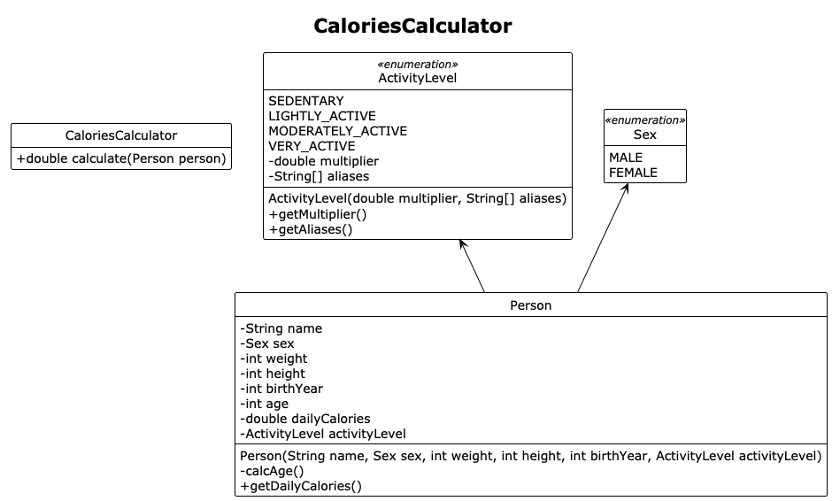
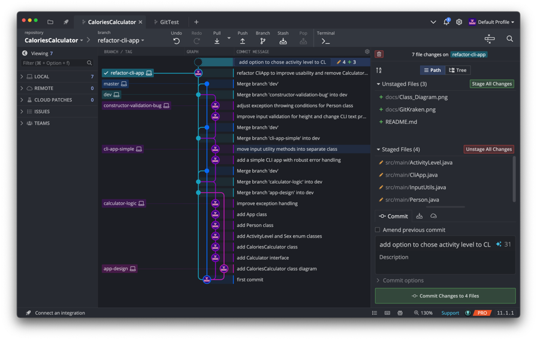

# CaloriesCalculator Java CLI Tool

## Abstract

This is **my very first simple Java CLI Tool** as part of my Backend x DevOps journey. Its purpose is straightforward — calculate a person's _Total Daily Energy Expenditure (TDEE)_.

## How it works

After running the app, the user is prompted to type their name, sex, weight, height, birth year and activity level into the CLI. Once the user inputs are all validated, they are used as arguments to instantiate a Person object.

The Person object is then passed as an argument to a previously instantiated CaloriesCalculator object, whose `calculate()` method returns the user's TDEE. The value is stored in the Person object.

## Algorithm to calculate calories

Before diving into this project it was necessary to understand how to calculate a person's calories accurately. 

The process consists of three steps:

1. Calculate the BMR (calories needed for basic bodily functions)
2. Determine the activity level
3. Calculate the TDEE (product of BMR times activity level multiplier &rarr; total calories needed to maintain bodyweight)
4. Additional: add or substract a percentage from the TDEE depending if you want to lose or gain weight

### Calculate the BMR

The BMR is the number of calories the human body needs at rest to maintain basic functions like breathing, nutrient processing and cell production.

The BMR can be calculated using the [Mifflin-St Jeor Equation](https://en.wikipedia.org/wiki/Basal_metabolic_rate):

For men:
- `BMR = 10 * weight_in_kg + 6.25 * height_in_cm − 5 * age_in_years + 5`

For women:
- `BMR = 10 * weight_in_kg + 6.25 * height_in_cm − 5 * age_in_years − 161`

### Determine Activity Level

The activity level determines how active a person is in their day-to-day life:

| **Level**         | **Description**                   | **Multiplier** |
|-------------------|-----------------------------------|----------------|
| Sedentary         | Little to no exercise             | 1.2            |
| Lightly Active    | Light exercise (1–3 days/week)    | 1.375          |
| Moderately Active | Moderate exercise (3–5 days/week) | 1.55           |
| Very Active       | Hard exercise (6–7 days/week)     | 1.725          |

### Calculate the TDEE

The TDEE stands for Total Daily Energy Expenditure and its the product of multiplying the BMR times the activity level multiplier.

`TDEE = BMR * Activity Level Multiplier`

### Code Snippet

This is how I implemented this logic in my code:

```java
public double calculate(Person person) {
    double bmr;
    if (person.getSex() == Sex.MALE) {
        bmr = 10 * person.getWeight() + 6.25 * person.getHeight() - 5 * person.getAge() + 5;
    } else {
        bmr = 10 * person.getWeight() + 6.25 * person.getHeight() - 5 * person.getAge() - 161;
    }

    double activityFactor = person.getActivityLevel().getMultiplier();

    return bmr * activityFactor;
}
```

## App Design

Before building the application I designed it in a UML class diagram. The application uses an object oriented programming (OOP) programming paradigm.



```java
Calculator calculator = new CaloriesCalculator();
person.setDailyCalories(calculator.calculate(person));
calculator = new MacrosCalculator();
person.setDailyMacros(calculator.calculate(person));
```

If I'd create a Calculator interface, this is how I could use polymorphism to add a new feature to also calculate the macros. However, I'm not entirely sure it would work as expected, since the MacrosCalculator would likely return an array or list of macros — grams of carbs, protein, and fat, rather than a single integer. The method signature must be the same for all classes who implement the interface.

## I have used AI to...

- learn how to calculate the calories and how the formulas work
- help me understand the difference between validating user input directly vs. catching exceptions
- learn more about the GitHub workflow — for example, start by creating a dev branch from the main branch. Then, create individual feature, refactor or bug-fix branches from the dev branch. Once each of them is complete, merge them back into the dev branch periodically. After all changes have been tested and reviewed, merge the dev branch into the main branch for release. This approach ensures the main branch is always functional.
- generate a regex expression `[A-Za-z]+` to check if the name contains one or more letters
- assist me in implementing the aliases for my enum class ActivityLevel and learn about the `values()` method

## Learnings

### GitKraken

I've used GitKraken for the first time while working on this project. I find it to be a great complementary to the CLI, because it nicely visualizes the repository's timeline and has neat features.



## Possible Future Improvements

- Add the option to choose caloric deficit or surplus depending on weight goal
- Test the app with unit tests
- Deploy the app to run inside a Docker container in the cloud
- Add a more advanced CLI tool with [picocli](https://picocli.info/)

## Resources

- [Java Regex Patterns](https://docs.oracle.com/javase/8/docs/api/java/util/regex/Pattern.html)
